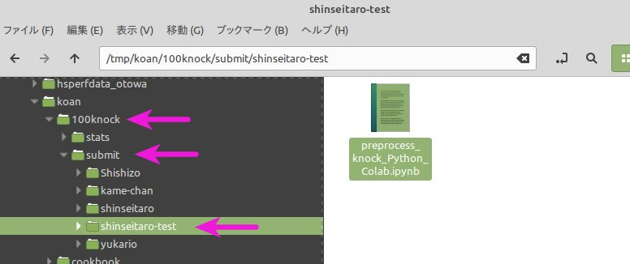
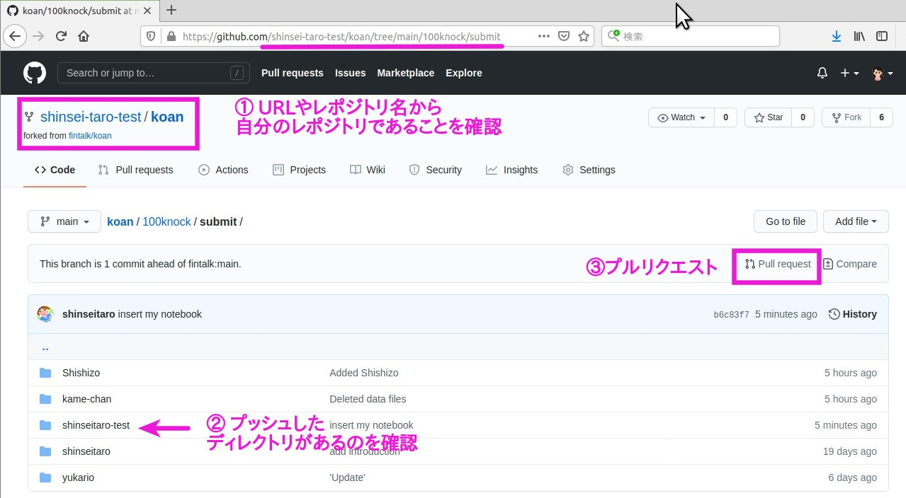
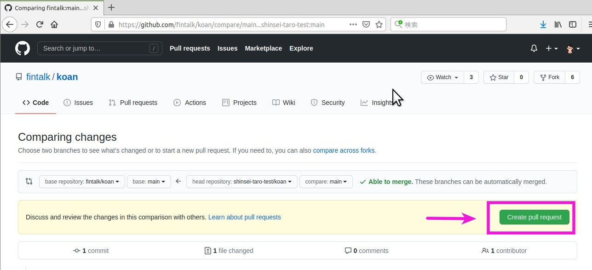
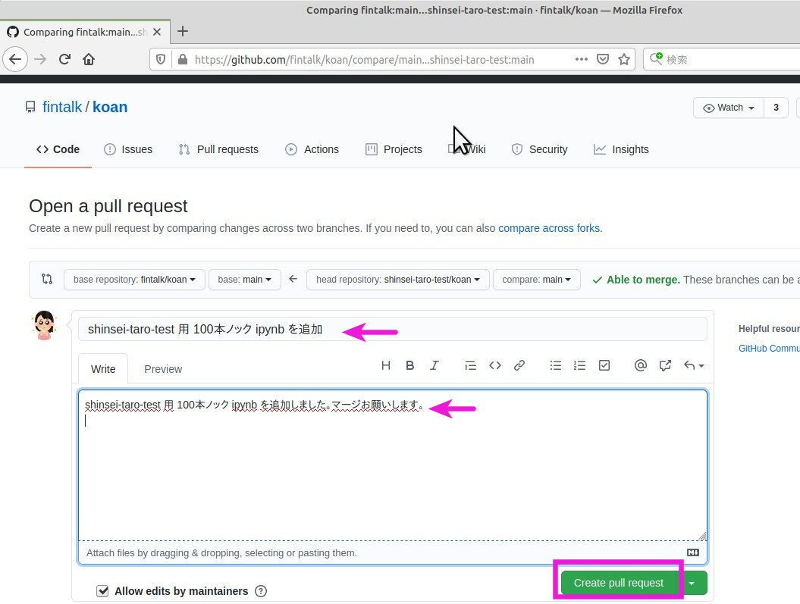

## 100本ノック

100本ノックは，
[noguhiro2002/100knocks-preprocess_ForColab-AzureNotebook: データサイエンス100本ノック（構造化データ加工編）For Azure_Notebook/Google_Colabo](https://github.com/noguhiro2002/100knocks-preprocess_ForColab-AzureNotebook)をみんなで勉強する会です．

## 解答方法

1. [koan/README.md](../README.md)を koan をclone
1. 100knock/submit/ ディレクトリ配下に自分の名前をつけたディレクトリを作成
    
1. ノートをコピペ
    + 初めて取り組むかた: `preprocess_knock_Python_Colab.ipynb` を自分のディレクトリ下にコピペして問題に取り組んで下さい．
    + すでに取り組んでいるかた: colabratory からファイルをダウンロードして、自分のディレクトリに入れて問題に取り組んで下さい．
1. 課題がある程度できたら、プッシュ。
    ```bash
    $ git add 100knock/submit/shinseitaro-test/preprocess_knock_Python_Colab.ipynb 
    $ git commit -m "insert my notebook"
    $ git push # ユーザー名とパスワードを聞かれるので答える
    Username for 
    Password for 
    ```
1. 自分のリモートを確認してプルリクエスト作成へ
    

    
1. pull request 用のメッセージは、どういう変更を加えたのかハッキリとわかるように書きましょう。マージする人が理解しやすいメッセージを心がけてください。
        
1. merge されると、登録しているメールアドレスに通知がいきます。


## 注意
+ `stats` にデータが格納されています．読み込む時のパスは `100knock/submit/shinseitaro/preprocess_knock_Python_Colab.ipynb` を参考にしてください．
+ わからないことがあったらいつでも slackで聞いて下さい．
