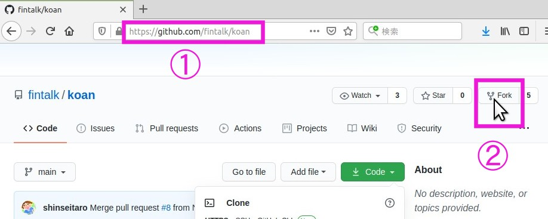
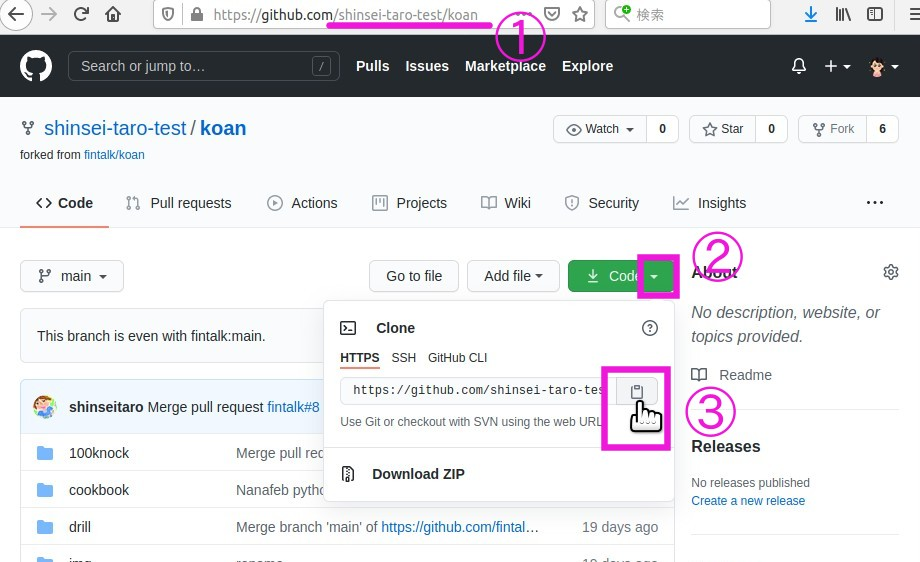
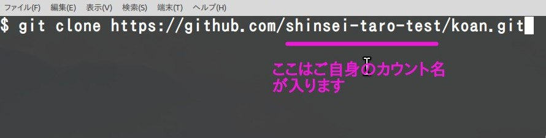

# koan

月刊Fintalk koan部の過去問や宿題用レポジトリ

## web で見つけた良さげな問題集リスト

+ [ゼロからのPython入門講座 - python.jp](https://www.python.jp/train/index.html)
+ [python-tutorial.ipynb - Colaboratory](https://colab.research.google.com/drive/1zeEsqVCK_Xmmiy0jlR5iTluFyu6FAiB1)


## koan の始め方

(github のアカウントをお持ちで、且つローカルマシンに git がインストールされていることが前提)

### pull request ルール

+ koan では ブランチを切らずにプルリクエストを投げて下さい。
+ 解答は各セクションの `submit` の下に名前を付けたディレクトリで提出してもらいますのでブランチはいりません。`main` で作業して下さい。


### 手順

1. 当レポジトリを fork する。
    
1. ご自身のレポジトリに fork された事を確認（①）後 clone 用のリンクをコピー。
    
1. ローカルPCにClone
    ```bash 
    # clone したいディレクトリで
    $ git clone https://github.com/<あなたのアカウント名>/koan.git
    ``` 
    
    ```bash
    # koan に移動して中身を確認
    $ cd koan
    $ ls # windows の場合は dir 
    100knock  README.md  cookbook  drill  img
    ```
1. 各セクションの問題に取り組んで下さい。


